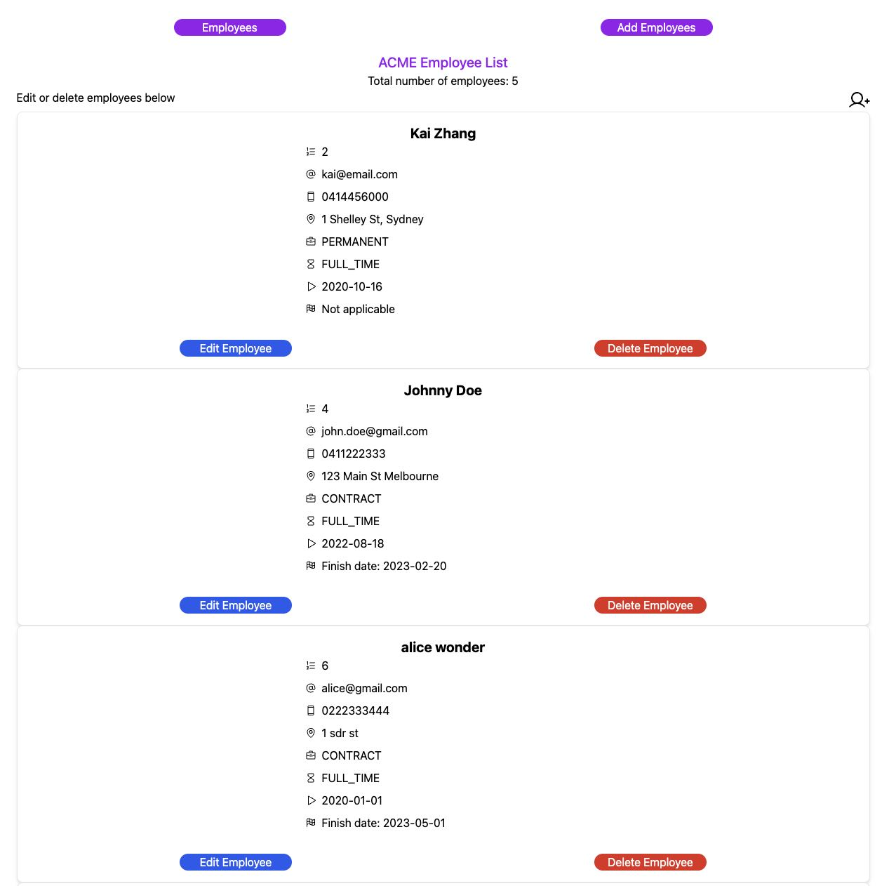
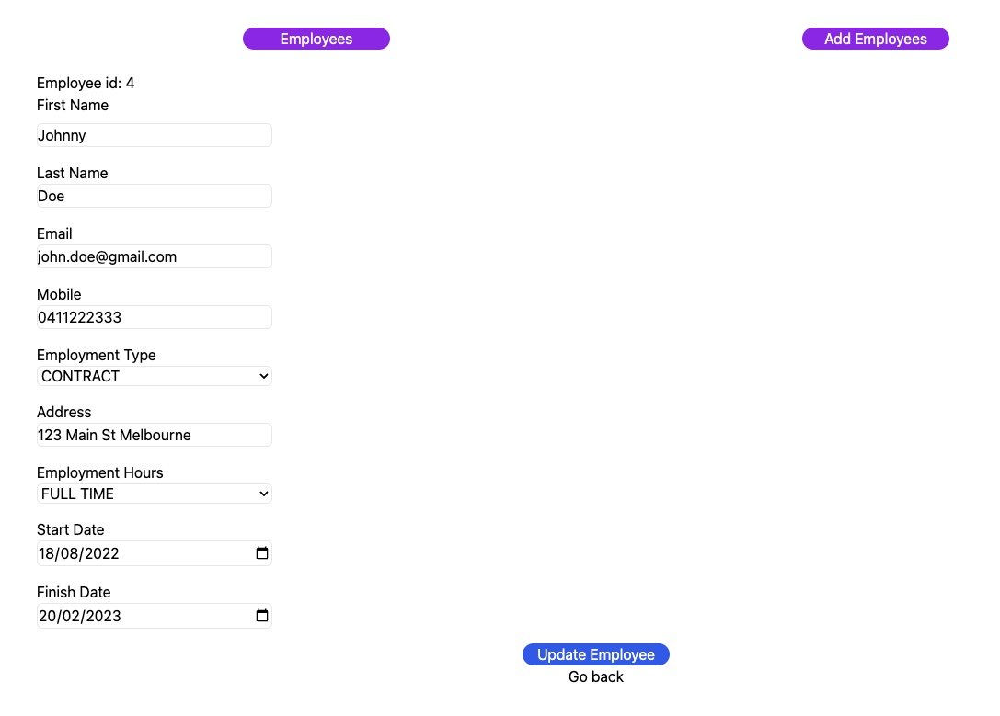

# Employee Creator - Full Stack

The Employee Creator is a full stack application with CRUD functionality developed on React and Spring.
Employees can be added, deleted or updated directly through the front end

**Hosted full stack link via Render** - [Employee Creator Online](https://employee-creator-front-end.onrender.com/)
Note that this is hosted on a free plan, so the database can take up to 3 - 5 minutes to load the data. Please reload the page after this time.

## Demo & Snippets

All employees:

Edit employees:

---

## Requirements / Purpose

-   MVP:
    -   Spring RESTful API and React Typescript frontend
    -   3 API end points (create employee, list of existing employees and delete employee)
-   Web app to create, list, modify and delete employees
-   Stack:
    -   Front end: Vite, React, TypeScript, Tailwind
        -   Front end dependencies include:
            -   @hookform/resolvers
            -   @phosphor-icons/react
            -   react-dom
            -   react-hook-form
            -   react-router-dom
            -   yup
            -   axios
    -   Back end: Java, Spring, mySQL (if localhost)
        -   Backend dependencies include:
            -   model mapper
            -   lombok
    -   Hosting: Render (Front end, Back end, Database)

---

## Build Steps on local machine

-   Build the project using `npm install` via terminal
-   After installation, cd into `employee-frontend` and then run the front end using `npm run dev` and then press `o` or click the local link. This will run on localhost port 5173
-   Create the database table using mySQL and running the command `CREATE DATABASE employee_creator`.
-   Update the src/main/resources/static/application.properties to use the mySQL config, and comment out the PostgreSQL config (which is for online)
-   The back end is started by running `EmployeecreatorApplication.java` in the `src/main/java/io/nology/employeecreator` folder. This will run on port 8080

---

## Design Goals / Approach

-   I wanted the design to be minimalistic and provide only the necessary information
-   This design was chosen as it is easy to use and user friendly

---

## Features

-   The project is a working full stack application to add, modify and delete employees from a database
-   Create new employee form is created through React Hook Form and Yup validation
-   Icons are from Phosphor icons

---

## Known issues

-   N/A

---

## Future Goals

-   Additional styling and visual uplift
-   Add React testing

---

## Change logs

### 22/08/2023 - Initial Commit and back end MVP

-   Implemented the Spring back end with working CRUD
-   Added React / TS front end to get all employees
-   Added tailwind

### 30/08/2023 - Added create new employee functionality for front end

-   Implemented the create new employee form for the front end
-   Form validation added via yup resolver

### 31/08/2023 - Added update functionality and styling to front end

-   Implemented updating of employees form for the front end
-   Added button styling and icons

### 12/09/2023 - Added tests Java

-   Added test for EmployeeService layer

### 19/09/2023 - Updates based on feedback

-   Updates based on feedback:
    -   added validation for phone number
    -   now capture and display part time hours when employment type is part time
    -   finish date validation requires at least on or after start date
    -   created new EmployeeForm which merged the newEmployee and updateEmployee components
    -   updated styling for errors to make it visually stand out

### 20/09/2023 - Added endpoint for dynamic selections

-   new endpoint in backend for `employmentTypes` and `employmentHours`
-   updated front end to get retrieve the employmentTypes and employmentHours from the end points and dynamically populate the selections on the Employee Form
-   Added additional tests for creating and updating employees
-   Replaced boiler code with lombok

### 18/10/2023 - Hosted the full stack application on Render

-   Hosted application on Render. End point for backend is https://employee-creator.onrender.com/
-   Updated CORS and front end code to enable hosted domain
-   Docker build for the backend

---

## What did you struggle with?

-   First repo that I have created using TypeScript for the front end
-   This was also the first project I have created using Tailwind for CSS (previously have used SCSS). Tailwind has a lot of new syntax to learn however I can see the potential efficiencies and use cases for Tailwind as it removes bespoke CSS code

---

## Licensing Details

-   Free for non-commercial use

---
